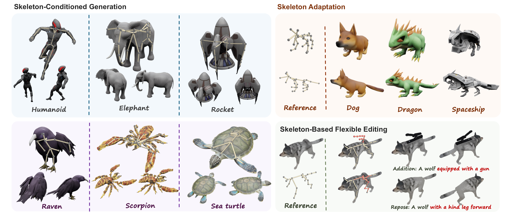

# SK-Adapter: Skeleton-Based Structural Control for Native 3D Generation

## 🏠 [Project Page](https://sk-adapter.github.io) | [Paper](https://arxiv.org/abs/2603.14152)



**SK-Adapter** is a lightweight and effective framework that unlocks precise skeletal manipulation for native 3D generation. Moving beyond text or image prompts, which can be ambiguous for precise structure, we treat the 3D skeleton as a first-class control signal. SK-Adapter encodes joint coordinates and topology into learnable tokens, which are injected into the frozen 3D generation backbone via cross-attention. This design allows the model to effectively "attend" to specific 3D structural constraints while preserving its original generative priors.

## 📢 News

- **2026-03-17:** Technical report is released on Arxiv.

## 📋 TODO

Code coming soon! Stay tuned!

- [ ] Release Objaverse-TMS dataset
- [ ] Release training code
- [ ] Release inference code and pretrained model

## 📖 Citation

If you find this work useful, please cite:

```bibtex
@Article{wang2026skadapterskeletonbasedstructuralcontrol,
  title     = {SK-Adapter: Skeleton-Based Structural Control for Native 3D Generation},
  author    = {Anbang Wang and Yuzhuo Ao and Shangzhe Wu and Chi-Keung Tang},
  journal   = {arXiv preprint arXiv:2603.14152},
  year      = {2026}
}
```
